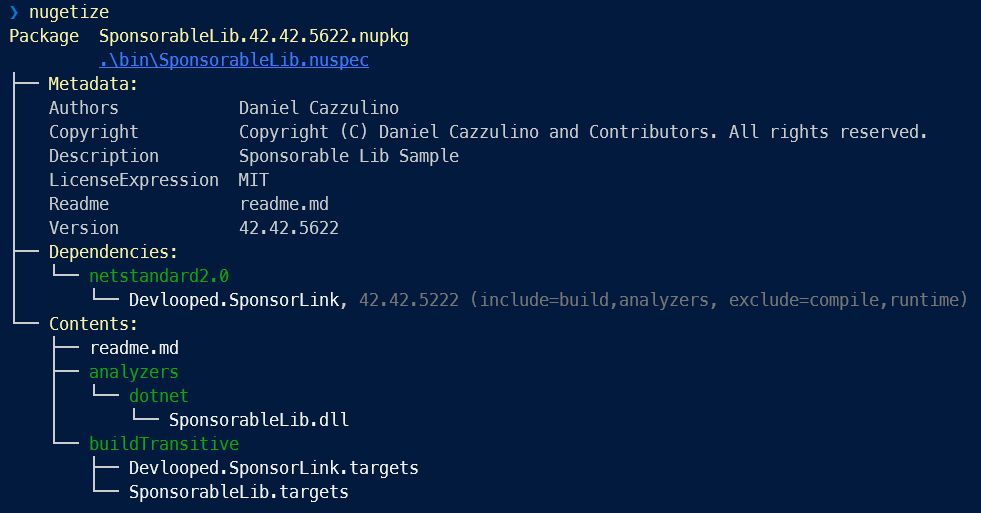

#  SponsorLink 

Integrate [GitHub Sponsors](https://github.com/sponsors) into your libraries so that 
users can be properly linked to their sponsorship to unlock features or simply get 
the recognition they deserve for supporting your project. 


SponsorLink supports two scenarios:

1. Open source project developers or maintainers who are looking to incentivize 
   sponsors to contribute to the project, to ensure ongoing and recurring income 
   that can help ensure proper maintenance and further feature work.

2. Open source project consumers, who want to ensure their dependencies have 
   an active team that can provide support, bug fixes and add new features.

[Read the announcement](https://www.cazzulino.com/sponsorlink.html) blog post.

##  Open source developers

[GitHub Sponsors](https://github.com/sponsors) provides the core functionality to 
accept sponsorships from all over the world. It's a great feature available for 
everyone. 

The "missing" link is a way for your oss project to check sponsorships seamlessly 
on consumers' machines, and reminding them to support the project, without being 
too annoying or obnoxious. 

All the pieces to build this are in place already, if you invest the time and 
infrastructure to implement it: 

- [Sponsor Webhooks](https://docs.github.com/en/sponsors/integrating-with-github-sponsors/configuring-webhooks-for-events-in-your-sponsored-account)
- [GitHub Apps](https://docs.github.com/en/developers/apps/getting-started-with-apps)

This project provides the plumbing for you, so you can just focus on your oss library :).

Integrating into your OSS project depends on the kind of library you provide. 
We offer initial support for .NET NuGet packages.

### Integrating via NuGet for .NET

[](https://www.nuget.org/packages/Devlooped.SponsorLink)
[](https://www.nuget.org/packages/Devlooped.SponsorLink)

Integration is very straightforward, especially if you use [NuGetizer](https://github.com/devlooped/nugetizer/).
Your NuGet package needs to add an analyzer/generator assembly/project, which performs the 
SponsorLink check during compilation. 

The following is an example analyzer that performs the SponsorLink check:

Project:
```xml
<Project Sdk="Microsoft.NET.Sdk">

  <PropertyGroup>
    <PackageId>SponsorableLib</PackageId>
    <PackFolder>analyzers/dotnet</PackFolder>
    <TargetFramework>netstandard2.0</TargetFramework>
  </PropertyGroup>

  <ItemGroup>
    <PackageReference Include="NuGetizer" />
    <!-- Roslyn min version is 4.0.1 -->
    <PackageReference Include="Microsoft.CodeAnalysis.CSharp" Version="4.0.1" Pack="false" />
    <PackageReference Include="Devlooped.SponsorLink" />
  </ItemGroup>
  
</Project>
```

> NOTE: NuGetizer will take care of generating the right dependency entry for SponsorLink,
> avoiding a downstream (library) reference for consumers.



If you are *not* using [NuGetizer](https://nuget.org/packages/nugetizer) for packing, 
make sure your `.nuspec` contains the proper `include/exclude` attributes for the 
SponsorLink [dependency](https://learn.microsoft.com/en-us/nuget/reference/nuspec#dependencies-element):

```xml
<package xmlns="http://schemas.microsoft.com/packaging/2012/06/nuspec.xsd">
  <metadata>
    ...
    <dependencies>
      <group targetFramework="[TF]">
        <dependency id="Devlooped.SponsorLink" version="[version]" 
                    include="build,analyzers" 
                    exclude="compile,runtime" />
      </group>
    </dependencies>
  </metadata>
</package>
```

Analyzer:

```csharp
using Devlooped;
using Microsoft.CodeAnalysis;
using Microsoft.CodeAnalysis.Diagnostics;

namespace SponsorableLib;

[DiagnosticAnalyzer(LanguageNames.CSharp, LanguageNames.VisualBasic)]
class SponsorLinker : SponsorLink
{
    public SponsorLinker() : base("[YOUR_ACCOUNT]", "[YOUR_PROJECT]") 
    { }
}
```

Packing and installing the resulting nuget package will result in the following user 
experience:

1. User does not have the [GitHub SponsorLink](https://github.com/apps/sponsorlink) (user) 
   app installed in his personal account. [Warning SL02](/docs/SL02.md):

   

2. User installed the app, but is not sponsoring the sponsorable account. 
   [Warning SL03](/docs/SL03.md):

   

3. User installed the app and is sponsoring:

   


If you are using [NuGetizer](https://github.com/devlooped/nugetizer/) for packing your main 
library, you just need to add a project reference to that project and the right packaging 
will happen (remove the PackageId property in that case, since the referencing project will 
be the one doing the packing).

Check out [the complete example](samples/dotnet) plus test project (which can be debugged by just pressing F5 in Visual Studio).

In addition to surfacing the supported diagnostics in Visual Studio in the default language (english):

   

we also support localized versions:

   

Please consider contributing translations by adding the relevant resource file under the [loc](/loc) folder.

#### Transitive Analyzer References

Currently, the .NET SDK (in combination with NuGet) *always* includes analyzers 
transitively from *all* dependencies (project and package references). This is 
a [known issue](https://github.com/dotnet/sdk/issues/1212) which might eventually 
be resolved, but for the time being, it means your package might end up causing 
SponsorLink checks transitively on projects that don't even reference your package, 
simply through project-to-project references. This can cause build errors since 
SponsorLink relies on some build properties being surfaced to the analyzer via 
compiler-visible properties and items.

So at this time, the following (NuGetizer only) steps are necessary to workaround 
the .NET SDK issue:

1. Add `GeneratePathProperty="true"` on the package reference to SponsorLink:

  ```xml
  <PackageReference Include="Devlooped.SponsorLink" Version="0.10.0" GeneratePathProperty="true" />
  ```

2.Pack SponsorLink targets alongside your package targets by adding to the project file:

  ```xml
  <ItemGroup>
    <None Include="$(PkgDevlooped_SponsorLink)\buildTransitive\Devlooped.SponsorLink.targets" 
          PackFolder="buildTransitive" 
          CopyToOutputDirectory="PreserveNewest" />
  </ItemGroup>
  ```

3. Make sure you include a `buildTransitive` targets file with your project, by adding a 
   .targets named after your package ID and specifying the pack properties for NuGetizer 
   as follows:

  ```xml
  <ItemGroup>
    <None Update="[PACKAGE_ID].targets" PackFolder="buildTransitive" />
  </ItemGroup>
  ```

4. Import the SponsorLink targets if not imported already, from your build targets from 
   the previous step, such as:

  ```xml
  <ItemGroup Label="SponsorLink">
    <!-- Let SponsorLink know your package ID for transitive checks -->
    <SponsorablePackageId Include="[PACKAGE_ID]" />
  </ItemGroup>

  <!-- Ensure SponsorLink targets are always imported -->
  <Import Project="Devlooped.SponsorLink.targets" 
          Condition="$(SponsorLinkImported) != true"/>
 ```

This ensures end users don't get build errors from missing SponsorLink compiler properties.
End users can also fix issues by installing the 
[Devlooped.SponsorLink](https://nuget.org/packages/Devlooped.SponsorLink) on failing projects, 
even if your package fails to provide the above workarounds.


### Registering with SponsorLink

Setting up SponsorLink for your sponsor account involves the following steps:

1. [Sponsor Devlooped](https://github.com/sponsors/devlooped): you will need to have 
   an active monthly sponsorship to use SponsorLink on an ongoing basis. You can try 
   it with a one-month subs too. There is no minimum tier (for now?), we want this to 
   be accessible to as many oss developers as possible.
2. Install the [SponsorLink Admin](https://github.com/apps/sponsorlink-admin) GitHub
   app: this will "link" your sponsorable account with your sponsorship.
3. Email sponsorlink@devlooped.com to request your shared secret to secure your webhooks 
   with SponsorLink.
4. Add a Sponsors webhook from your dashboard at `https://github.com/sponsors/[SPONSORABLE]/dashboard/webhooks` with the following values:
   * Payload URL: `https://sponsorlink.devlooped.com/sponsor/[SPONSORABLE]`
   * Content type: `application/json`
   * Secret: the secret received from us via email.
5. *Only* if you have existing sponsors: right now, [GitHub apps cannot access the sponsors API](https://github.com/orgs/community/discussions/44226), so we'll need to get them from you via email until 
   that's fixed. Email sponsorlink@devlooped.com with the response of running the following 
   GraphQL query at https://docs.github.com/en/graphql/overview/explorer:
   ```
   query { 
     organization(login: "[SPONSORABLE]") {
       id
       login
       sponsorshipsAsMaintainer(first: 100, orderBy: {field: CREATED_AT, direction: ASC}, includePrivate: true) {
         nodes {
           createdAt
           isOneTimePayment
           sponsorEntity {
             ... on Organization {
               id
               login
             }
             ... on User {
               id
               login
             }
           }
           tier {
             monthlyPriceInDollars
           }
         }
       }
     }
   }
   ```
   We will run a one-time process to link the reported sponsorships with your sponsorable account.
   Whenever GitHub adds support for querying this information, this step will no longer be necessary.


##  Open source consumers

The experience for consumers intentionally targets IDE/Editor usage only. If users build 
on CI or via command-line, no sponsorship checks should be performed at all. The experience 
will vary depending on the asset being consumed.

### .NET NuGet package experience

After installation/restore, your users will consume your library just as usual. During 
command line and CI builds, as well as intellisense builds (a.k.a. design-time builds), 
SponsorLink will not perform any checks, so as to minimize its impact on those scenarios.

For regular builds performed in an editor/IDE, the analyzer will issue the warnings 
shown above for the three scenarios: GitHub app not installed, app installed but not 
sponsoring, and app installed and sponsoring.

Upon installing the [SponsorLink](https://github.com/apps/sponsorlink) GitHub 
app (*not* the Admin one), users authorize access to their email addresses, which are 
used from that point on to match their sponsorship. 

The ordering of app install and sponsorship is irrelevant, and SponsorLink will properly 
link both regardless of which happens first.

Initially, no tier-checking is performed, only that a sponsorship is active at check 
time.

Over time, we expect many libraries will use this and too many "Thank you" can become 
a bit noisy. In that case, you can disable that at the assembly level with:

```csharp
[assembly: SuppressMessage("SponsorLink", "DSL04")]
```

## How it works

This section is mostly taken from [the announcement blob post](https://www.cazzulino.com/sponsorlink.html#how-it-works), and is intended as a reference for those interested in the implementation details.

> NOTE: the reason why the .NET implementation of SponsorLink isn't provided as OSS, is that
> given that its intention is to ensure that users receive their sponsorship stauts notifications, 
> making the source available might only help those that want to circumvent it.
> If you are integrating SponsorLink into your own OSS projects and want to understand how it works,
> we will make the source available to you upon request.

SponsorLink will *never* interfere with a CI/CLI build, neither a design-time build. 
These are important scenarios where you don't want to be annoying your fellow OSS 
users. This means SponsorLink doesn't require setting up licenses on a server, provisioning 
test agents or whatever. Also, if your users are building from the command line, it's not as 
if they are enjoying using the OSS library all that much at that moment.

Even though we initially support [SponsorLink for .NET](https://www.nuget.org/packages/Devlooped.SponsorLink) 
via a nuget package, the backend is agnostic to the client. If this takes off, we may add 
other ecosystems.

The non-.NET specific way it works for library users is:

1. If the user isn't using an editor or there is no network, there's nothing to 
   do, so we bail quickly and no-op.
2. SponsorLink runs `git config --get user.email` during build to get the 
   current user's configured email. If there's no `git` or `email`, there's nothing 
   to do. No real work is done nowadays without both, right? :)
3. A quick HTTP operation is sent to Azure Blob storage (via CDN for better performance 
   and geo-distribution) to a relative URL ending in `/apps/[user_email]`. If it's a 404, 
   it means the user hasn't installed the [SponsorLink GitHub app](https://github.com/apps/sponsorlink). 
   This app requests *read* access to the users' email addresses, so the previous 
   check can succeed.
4. If the previous check succeeds, a second HTTP operation is send to Azure Blob 
   storage (again via CDN) to a URL ending in `/[sponsor_account]/[user_email]`. If it's a 404, 
   it means the user isn't sponsoring the given account.

In both 3) and 4), users are offered to fix the situation with a link to install the app, 
and then sponsor the account.

> NOTE: the actual email is *never* sent. It's hashed with SHA256, then Base62-encoded.
> The only moment SponsorLink actually gets your email address, is *after* you install 
> the [SponsorLink GitHub app](https://github.com/apps/sponsorlink) and give it explicit
> permission to do so.

On the sponsor account side, the way it works at a high level is:

1. One-time [provision of your account](https://github.com/devlooped/sponsorlink#-open-source-developers), 
   by installing the [SponsorLink Admin GitHub app](https://github.com/apps/sponsorlink-admin) and 
   setting up a Sponsors webhook in your dashboard to notify SponsorLink of changes from your sponsors.
2. Integrating the [SponsorLink for .NET](https://www.nuget.org/packages/Devlooped.SponsorLink) 
   nuget package and shipping it with your library: it ships as an analyzer of your library.

And that's it!

From this point on, any new sponsor will immediately be notified to SponsorLink which 
will update the Azure Blob storage account with the right entries so that in mere seconds 
the experience quickly goes from Install GH app > Sponsor account > Thanks!

> NOTE: if the user belongs to the sponsorable (organization) account, its email > sponsor 
> account is registered as well so we don't fail the check, but no diagnostics are generated 
> in the editor at all.


## Safety and Security

SponsorLink does not receive any information about users' code, repositories, or credentials, 
since none of those permissions are requested when installing the GitHub app and authorizing 
it.


<!-- include https://github.com/devlooped/sponsors/raw/main/footer.md -->
# Sponsors 

<!-- sponsors.md -->
[](https://github.com/clarius)
[](https://github.com/augustoproiete)
[](https://github.com/KirillOsenkov)
[](https://github.com/MFB-Technologies-Inc)
[](https://github.com/sandrock)
[](https://github.com/agocke)
[](https://github.com/decriptor)
[](https://github.com/torutek-gh)


<!-- sponsors.md -->

[](https://github.com/sponsors/devlooped)
&nbsp;

[Learn more about GitHub Sponsors](https://github.com/sponsors)

<!-- https://github.com/devlooped/sponsors/raw/main/footer.md -->
